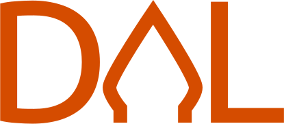

<p align="center">
    
</p>

Dal is a general-purpose programming language designed to be simple yet powerful. It is a statically typed language with
a focus on performance and simplicity. It is designed to be easy to learn and use.

> __Warning__ \
> This project is still in early development and is not ready for production use.


[](https://circleci.com/gh/dal-lang/dal)

## Beautiful Syntax

Dal syntax is rust-like and easy to read.

```rust
import "std/io"

pub fn main() {
    io.println("Hello, World!")
}
```

## Generics

Generics allow you to write code that works for any data type.

```rust
fn sum[T](a: T, b: T) -> T {
return a + b
}

pub fn main() {
    io.println(sum(1, 2))
    io.println(sum(1.0, 2.0))
}
```

## Link to C

Dal can link to C library and use it in your code.

```rust
@link("c")
extern {
    pub fn printf(__fmt: *const *const u8, ...) -> i32
}

pub fn main() {
    printf("Hello, World!\n")
}
```

Read more about Dal in the [documentation](./markdown/doc.md).

## Contributing

Dal is an open source project and contributions are welcome. If you want to contribute, please read
the [contributing guide](./markdown/contributing.md).

## License

Dal priority is to serve and help the community to build amazing things. That's why Dal using the
most liberal license possible, the [MIT license](./LICENSE).